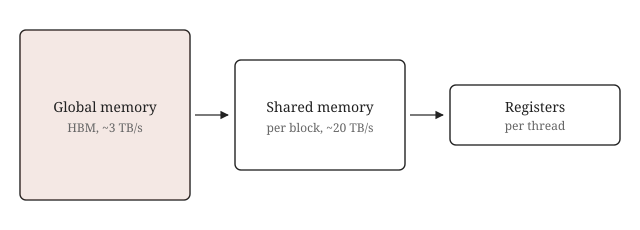

import Figure from '../../../components/Figure.astro';
import MarginNote from '../../../components/MarginNote.astro';
import memory from './memory.svg';

This post is a template. It is marked `draft: true`, so it only appears when you run `npm run dev` and is never published. Copy what you need from it, then delete the folder.

## Sidenotes

A sidenote is a normal Markdown footnote.[^first] Write `[^name]` in the text and define `[^name]: ...` anywhere in the file. On a wide screen the note sits in the right margin next to the line that references it. On a phone, tapping the number opens it below the line.[^second]

[^first]: Like this one. It can contain *emphasis*, `code` and [links](https://github.com/Kheims).

[^second]: Notes can also hold math such as $O(n^3)$.

    A second paragraph works too.

In an `.mdx` post you can also add an unnumbered margin note, useful for a small remark or a thumbnail figure.<MarginNote>An unnumbered margin note, written with the `MarginNote` component.</MarginNote>

## Math

Inline math uses single dollars: the kernel performs $2MNK$ floating point operations. Display math uses double dollars:

$$
C_{ij} = \sum_{k=1}^{K} A_{ik} \, B_{kj}
$$

## Code

Fenced code blocks are highlighted at build time and follow the light or dark theme.

```cuda
__global__ void sgemm_naive(int M, int N, int K, const float *A, const float *B, float *C) {
  const uint x = blockIdx.x * blockDim.x + threadIdx.x;
  const uint y = blockIdx.y * blockDim.y + threadIdx.y;
  if (x < M && y < N) {
    float tmp = 0.0;
    for (int i = 0; i < K; ++i) tmp += A[x * K + i] * B[i * N + y];
    C[x * N + y] = tmp;
  }
}
```

## Figures

In plain Markdown, an image alone on its line becomes a figure and its title becomes the caption:



In MDX, the `Figure` component adds a `wide` option that extends the figure into the margin:

<Figure src={memory} alt="Memory hierarchy of a GPU" caption="A wide figure spans the text column and the margin." wide />

## Everything else

Tables, quotes and lists are plain Markdown.

| Kernel | GFLOPs/s | vs. cuBLAS |
| --- | ---: | ---: |
| Naive | 309 | 1.3% |
| Coalesced | 1987 | 8.5% |

> A quote looks like this.

---

That's all there is.
